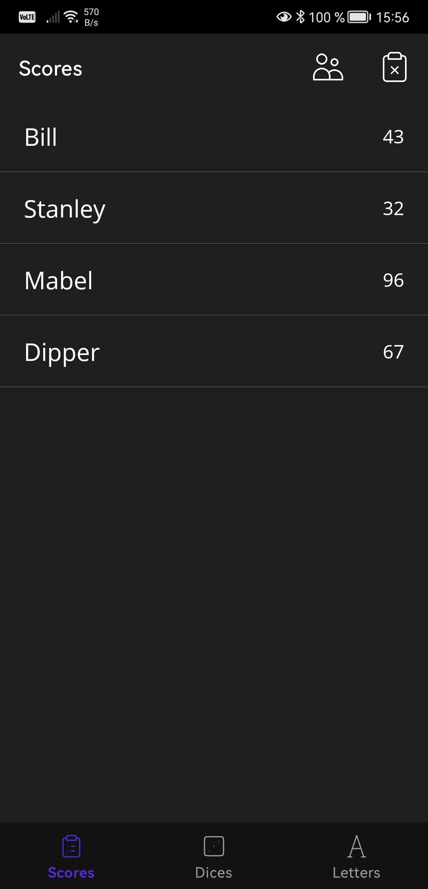
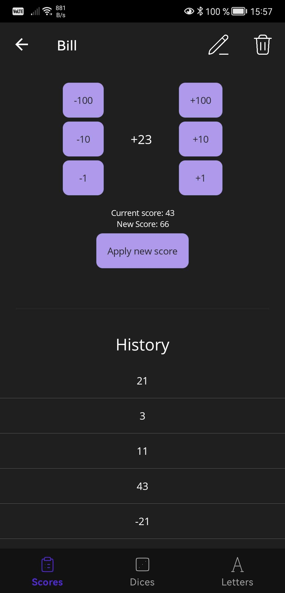
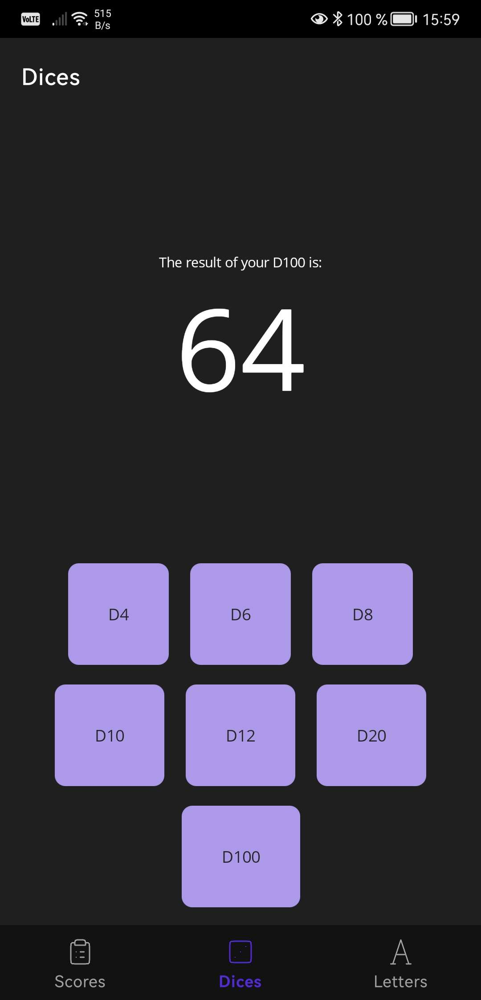
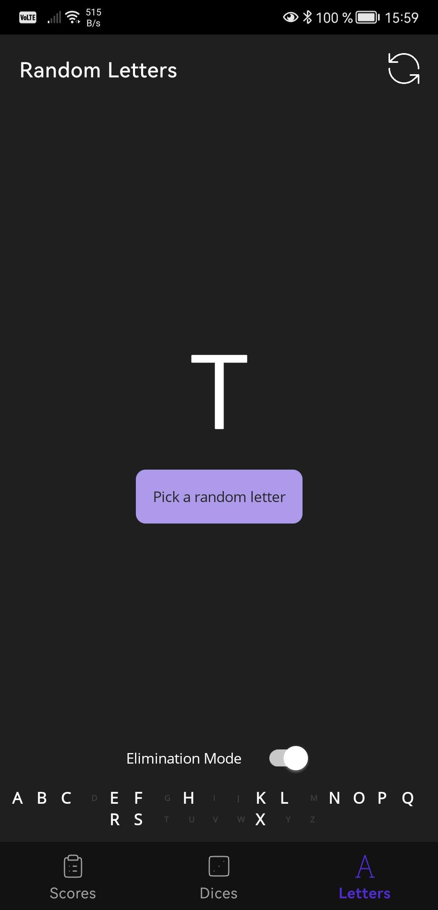

# Board Game Toolbox

**Board Game Toolbox** is a versatile, privacy-focused mobile app designed to help you keep track of scores and add randomization to your gaming sessions. Built with `.NET MAUI`, the app offers a clean, intuitive interface for users, and stores all data locally using LiteDB to protect your privacy.

## Features
- **Three Core Modes:**
  - **Score Tracking Mode:** Easily track the score of a board game session for multiple players or teams.
  - **Dice Mode:** Roll virtual dice of various types, including d4, d6, d8, d10, d12, d20, and d100.
  - **Random Letter Mode:** Generate random letters, useful for word games and other activities. (Comes with an *Elimination mode* that prevent the user to pick the same letter twice)
- **Local Data Storage:** Uses LiteDB to save all data locally on your device—no internet connection required.
- **Privacy First:** We don’t collect or send any personal data to external servers or over the internet.
- **Ad-Free:** Enjoy uninterrupted use without annoying ads.

## Technologies Used
- **.NET MAUI**: A cross-platform framework for building native mobile apps.
- **Reactive Extensions (Rx)**: Utilized for asynchronous programming to make the app more responsive and efficient.
- **LiteDB**: A fast, lightweight, local NoSQL database to store scores directly on your device.

## Screenshots
<table>
  <tr>
    <td></td>
    <td></td>
    <td></td>
    <td></td>
  </tr>
</table>
